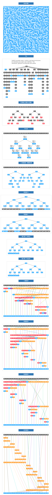

## 算法与数据结构

感谢 [@liuyubobobo](http://www.imooc.com/t/108955)

算法可视化 - 核心逻辑 课程参考

[《玩转算法与数据结构》](https://coding.imooc.com/learn/list/71.html)
[《算法大神带你玩转数据结构 从入门到精通》](https://coding.imooc.com/learn/list/207.html)

演示地址： [点击访问](http://codding.cn/#%7B%22coms%22%3A%5B%22algo%22%2C%22cctv%22%5D%2C%22idxChannel%22%3A0%2C%22idxAlbum%22%3A0%2C%22playDirection%22%3A1%2C%22searchText%22%3A%22%22%2C%22videoInfo%22%3A%7B%7D%2C%22idxAux9%22%3A0%2C%22countAni%22%3A1%2C%22page%22%3A%7B%22cur%22%3A0%2C%22size%22%3A100%2C%22total%22%3A3456%7D%2C%22hotWord%22%3A%7B%22cur%22%3A0%2C%22isShow%22%3Afalse%7D%2C%22dir%22%3A%7B%22cur%22%3A0%2C%22zIndex%22%3A0%2C%22list%22%3A%5B%5D%2C%22isReplaceCharacter%22%3Atrue%7D%7D)

