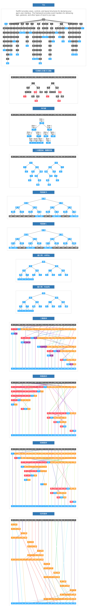

## 算法与数据结构

感谢 [@liuyubobobo](http://www.imooc.com/t/108955)

算法可视化 - 核心逻辑 参考课程

[《玩转算法与数据结构》](https://coding.imooc.com/learn/list/71.html)
[《算法大神带你玩转数据结构 从入门到精通》](https://coding.imooc.com/learn/list/207.html)

